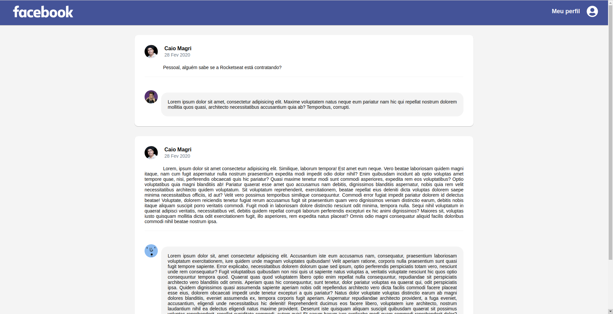

<h1 align="center">
  Twitter Flexbox
</h1>

  

  

  

  

 

  

## Projeto

O projeto tem por finalidade desenvolver uma aplicação clone do design da pagina web do Facebook, utilizando apenas styled components como ferramente principal.

## Tecnologias

Esse projeto foi desenvolvido com as seguintes tecnologias:

- ReactJS
- React Icons
- Styled Components
- [CSS Flexbox](https://origamid.com/projetos/flexbox-guia-completo/)
